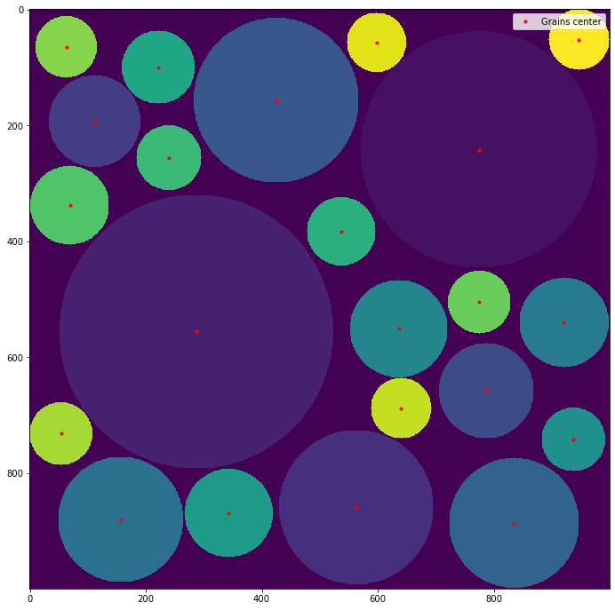
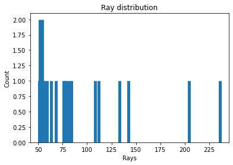
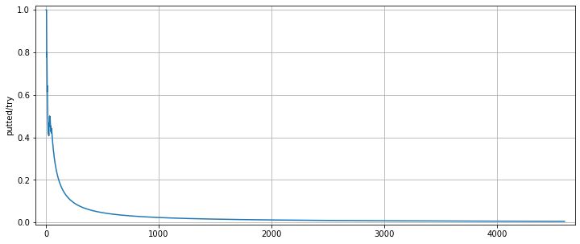
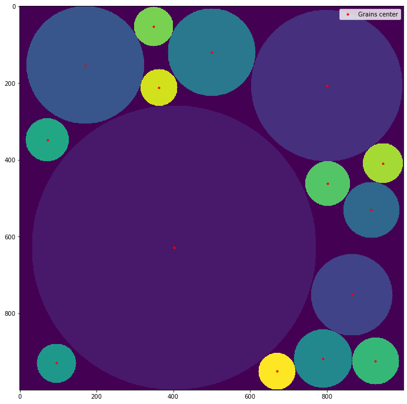
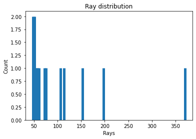
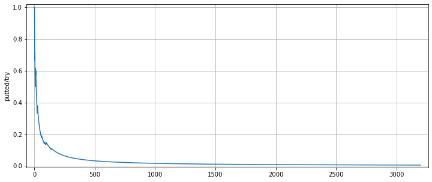
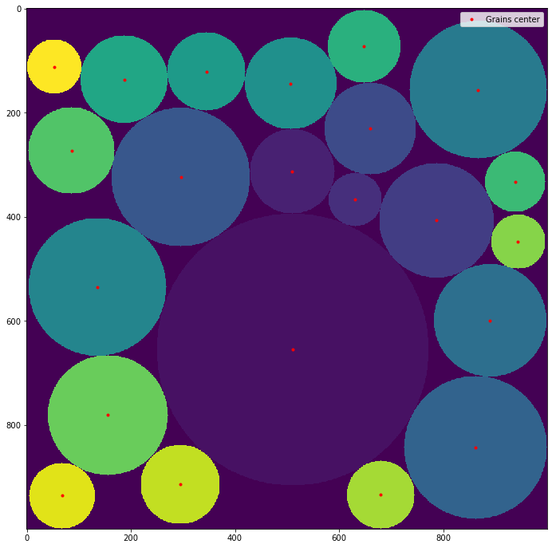
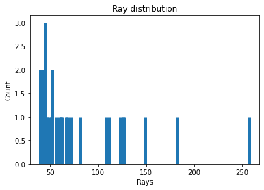

# Granular-box-filling
Simulation of the random filling of a box with grains of variable size

The list of functions and their purpose:

    ShowBox: function to show the box filled with grains.
  
    RepartGrains: Function to calculate (and plot if asked) the distribution of the grains put into the box.
  
    ShowTrying: Function to show the evolution of the sucess/try ratio.
  
    GranularFilling: Function to randomly fill a blank space with granular particules.
  
    DictioRangeRay: Function to create a dictionnarie of the relative positions of the bordure point of a dissk of ray n.
  
    CompacGranular: A more compact method to fill a box with circular particules of random rays.
  

a1, b1, c1 = GranularFilling(1000, [50, 400], 0.005, 'uniform', verbose=True)

a2, b2, c2 = GranularFilling(1000, [50, 400], 0.005, 'lrqc', verbose=True)

a3, b3 = CompacGranular(1000, [50, 400], verbose=True)

ShowBox(a1, b1)

RepartGrains(b1)

ShowTrying(c1)

ShowBox(a2, b2)

RepartGrains(b2)

ShowTrying(c2)

ShowBox(a3, b3)

RepartGrains(b3)

