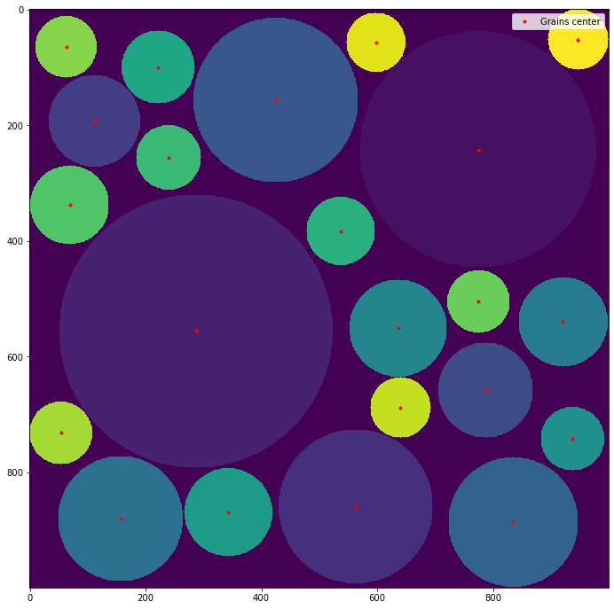
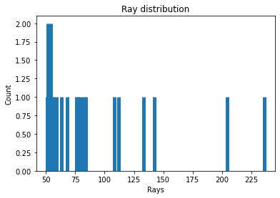
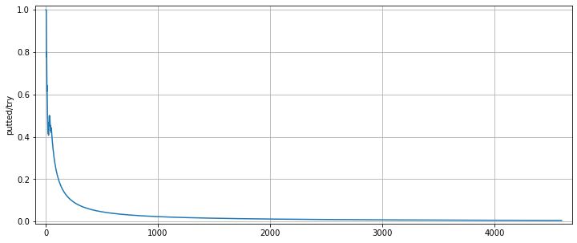
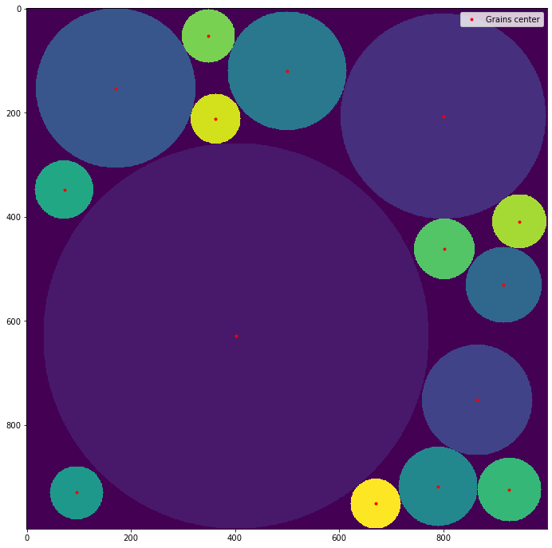
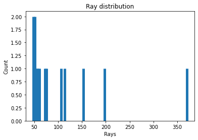
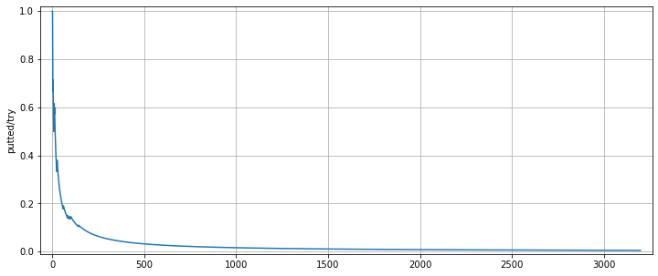
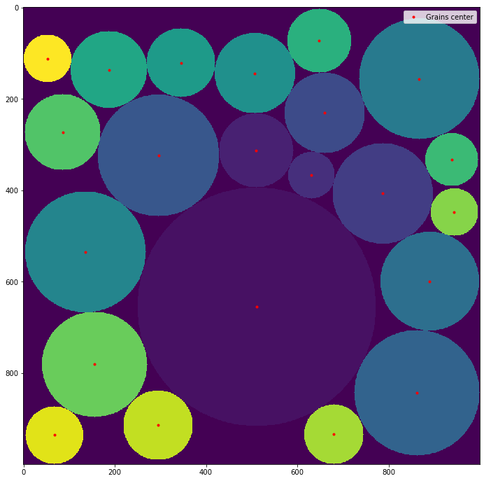
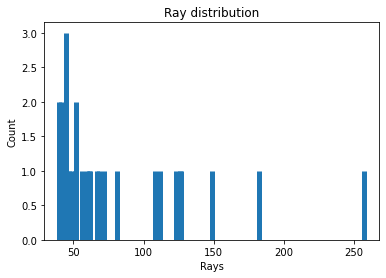

# Granular-box-filling
Simulation of the random filling of a box with grains of variable size

The list of functions and their purpose:

    show_box: function to show the box filled with grains.
  
    repart_grains: Function to calculate (and plot if asked) the distribution of the grains put into the box.
  
    show_trying: Function to show the evolution of the sucess/try ratio.
  
    granular_filling: Function to randomly fill a blank space with granular particules.
  
    dictio_range_ray: Function to create a dictionnarie of the relative positions of the bordure point of a dissk of ray n.
  
    compac_granular: A more compact method to fill a box with circular particules of random rays.
  

a1, b1, c1 = granular_filling(1000, [50, 400], 0.005, 'uniform', verbose=True)

a2, b2, c2 = granular_filling(1000, [50, 400], 0.005, 'lrqc', verbose=True)

a3, b3 = compac_granular(1000, [50, 400], verbose=True)

show_box(a1, b1)

repart_grains(b1)

show_trying(c1)

show_box(a2, b2)

repart_grains(b2)

show_trying(c2)

show_box(a3, b3)

repart_grains(b3)

